# ACN52832 arm mbed example
Pre-Requisites
--------------
Install arm mbed cli (with GCC) as described [here](https://os.mbed.com/docs/latest/tools/index.html).

To compile for the ACN52832 Board the following is needed:
- Target folder (TARGET_ACD52832) containing:
 - PinNames.h
 - device.h
 - PeripheralNames.h
- custom_targets.json
- changed mbed_app.json
This files are already included in this repository. Besides these Files this is a copy of the official arm MBED BLE Heartrate example.
Additional changes the commit log on github.

use 'mbed deploy' to download the mbed-os into the project.

compile using 'mbed compile -m ACD52832 -t GCC_ARM'

Copy the file 'arm_MBED_ACN52832_BLE.hex' file from BUILD/ACD52832/GCC_ARM to the JLink drive (usb drive, apears if ACD52832 gets plugged in to the computer).
After disconnect and reconnect of the JLink drive copy again (don't ask why, but code runs only after second upload).

# Original Readme begin:
--------------
# BLE Heart Rate Monitor

This application transmits a heart rate value using the [Bluetooth SIG Heart Rate Profile](https://developer.bluetooth.org/TechnologyOverview/Pages/HRP.aspx). The heart rate value is provided by the application itself, not by a sensor, so that you don't have to get a sensor just to run the example.

Technical details are better presented [in the mbed Classic equivalent of this example](https://developer.mbed.org/teams/Bluetooth-Low-Energy/code/BLE_HeartRate/).

# Running the application

## Requirements

To see the heart rate information on your phone, use the BLE Profiles App by ST:

- [ST BLE Profile](https://play.google.com/store/apps/details?id=com.stm.bluetoothlevalidation) for Android.

Alternatively, use a BLE scanner:

- [nRF Master Control Panel](https://play.google.com/store/apps/details?id=no.nordicsemi.android.mcp) for Android.

- [LightBlue](https://itunes.apple.com/gb/app/lightblue-bluetooth-low-energy/id557428110?mt=8) for iPhone.

Hardware requirements are in the [main readme](https://github.com/ARMmbed/mbed-os-example-ble/blob/master/README.md).

## Building instructions

Building instructions for all samples are in the [main readme](https://github.com/ARMmbed/mbed-os-example-ble/blob/master/README.md).

## Checking for success

**Note:** Screens captures depicted below show what is expected from this example if the scanner used is *ST BLE Profile* version 2.0.0 or *nRF Master Control Panel* version 4.0.5. If you encounter any difficulties consider trying another scanner or another version of nRF Master Control Panel. Alternative scanners may require reference to their manuals.

1. Build the application and install it on your board as explained in the building instructions.
1. Open the BLE scanner on your phone.
1. Start a scan.

    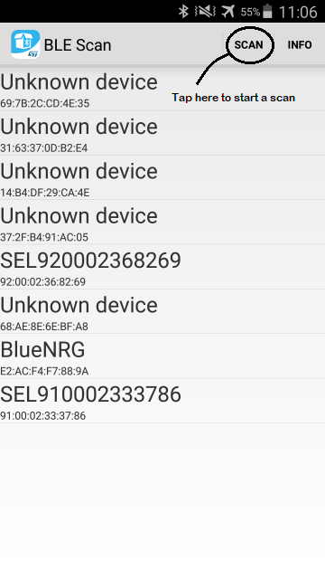

    **figure 1.a** How to start scan using ST BLE Profile 2.0.0

    

    **figure 1.b** How to start scan using nRF Master Control Panel 4.0.5

1. Find your device; it should be named `HRM`.

    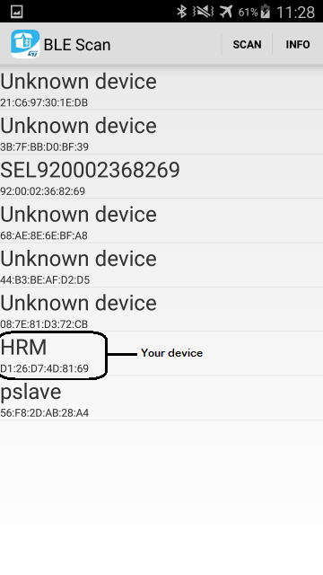

    **figure 2.a** Scan results using ST BLE Profile 2.0.0

    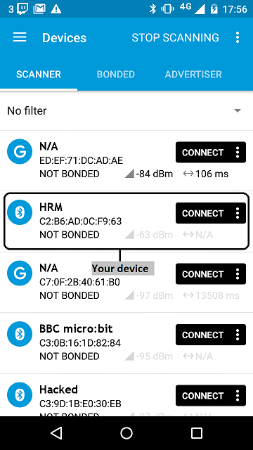

    **figure 2.b** Scan results using nRF Master Control Panel 4.0.5

1. Establish a connection with your device.

    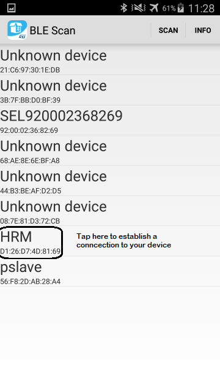

    **figure 3.a**  How to establish a connection using ST BLE Profile 2.0.0

    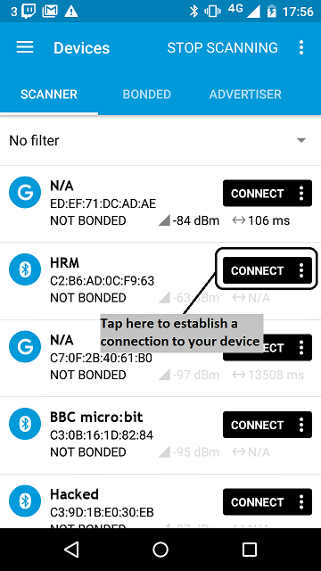

    **figure 3.b**  How to establish a connection using Master Control Panel 4.0.5

1. Discover the services and the characteristics on the device. The *Heart Rate* service has the UUID `0x180D` and includes the *Heart Rate Measurement* characteristic which has the UUID `0x2A37`.

    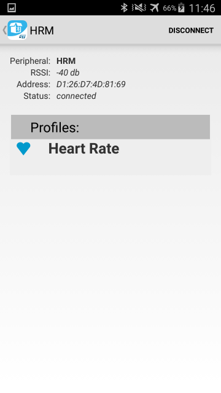

    **figure 4.a** Representation of the Heart Rate service using ST BLE Profile 2.0.0

    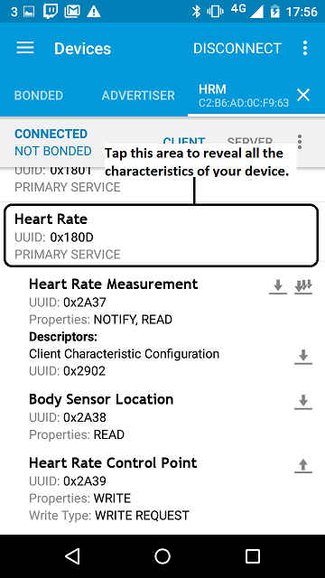

    **figure 4.b** Representation of the Heart Rate service using Master Control Panel 4.0.5

1. Register for the notifications sent by the *Heart Rate Measurement* characteristic.

    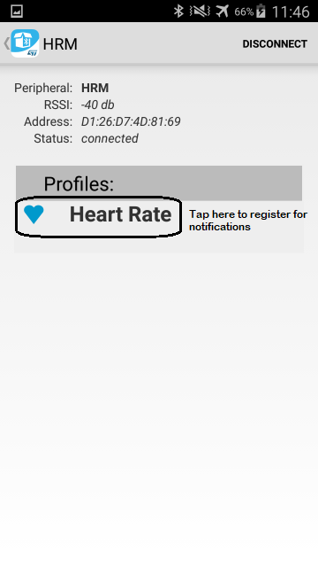

    **figure 5.a** How to register to notifications using ST BLE Profile 2.0.0

    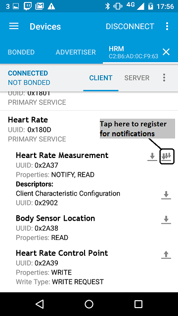

    **figure 5.b** How to register to notifications using Master Control Panel 4.0.5

1. You should see the heart rate value change every half second. For ST BLE Profile, it begins at 60, goes up to 100 (in steps of 1), resets to 60 and so on.

    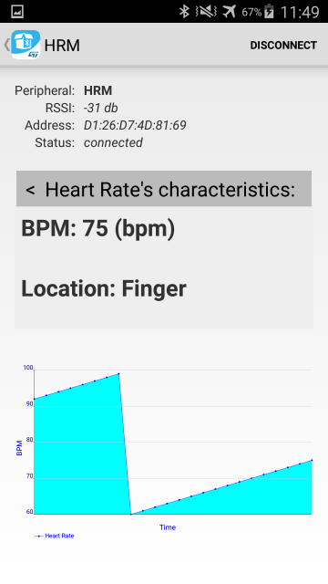

    **figure 6.a** Notifications view using ST BLE Profile 2.0.0

    For Master Control Panel, it begins at 100, goes up to 175 (in steps of 1), resets to 100 and so on.

    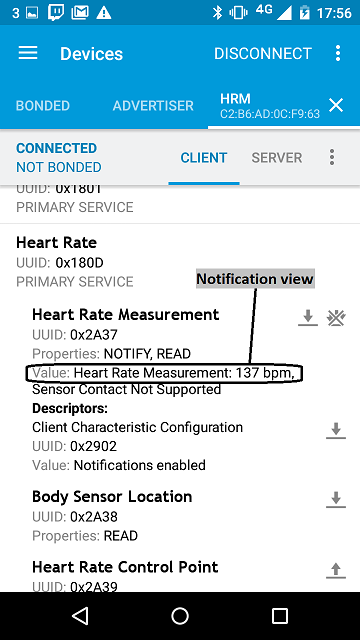

    **figure 6.b** Notifications view using Master Control Panel 4.0.5
